# Отчет по лабораторной №1

University: [ITMO University](https://itmo.ru/ru/)\
Faculty: FTMI\
Course: [introduction-in-web-tech](https://itmo-ict-faculty.github.io/introduction-in-web-tech)\
Year: 2025/2026\
Group: U4225\
Author: Laptev Anatoly Aleksandrovich\
Lab: Lab1\
Date of create: 29.09.2025\
Date of finished: 29.09.2025

1) docker --version\
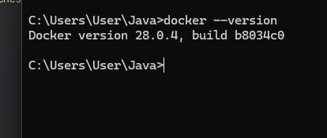
2) docker run hello-world
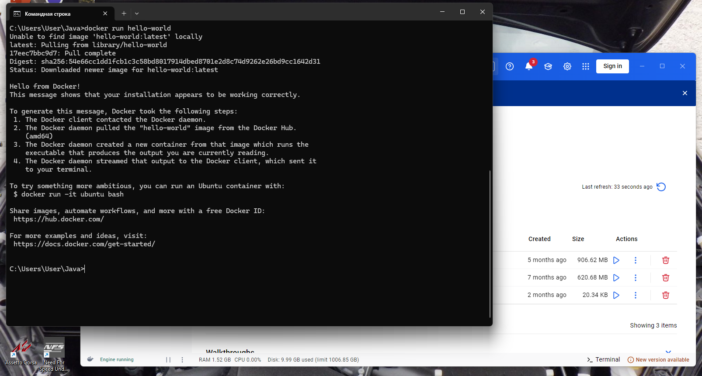
3) docker images, docker ps, docker ps -a
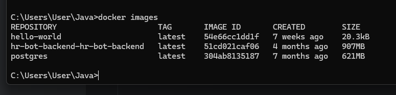
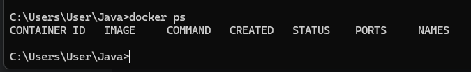
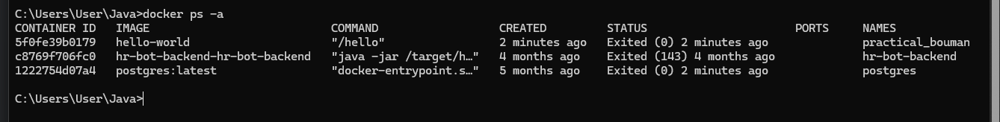
4) docker pull ubuntu:latest
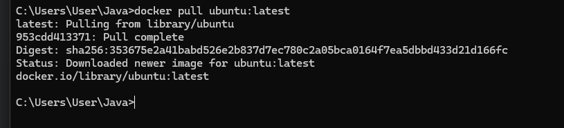
5) docker run -it ubuntu bash
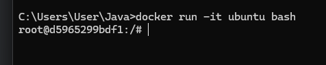
6) apt update && apt install -y curl
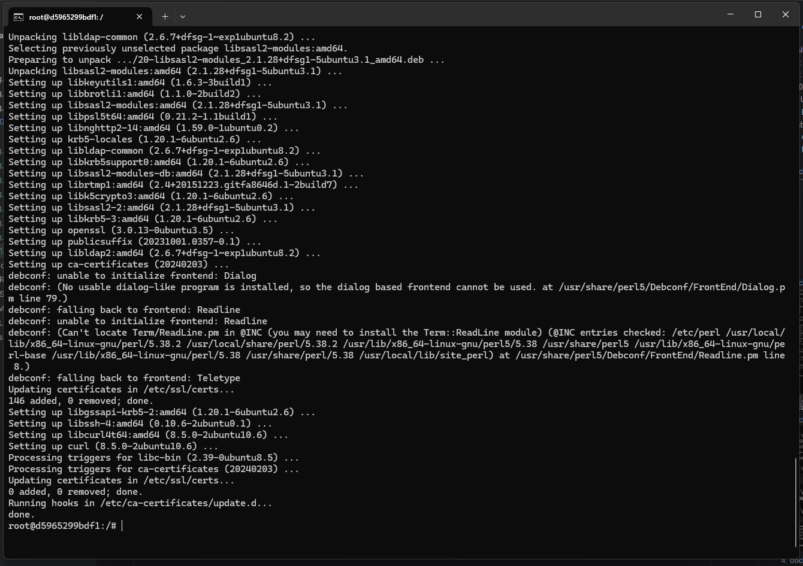
7) curl --version
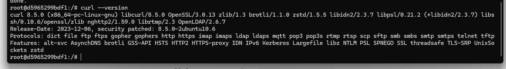
8) exit\
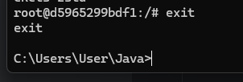
9) docker run -d -p 8080:80 --name web-server nginx:alpine
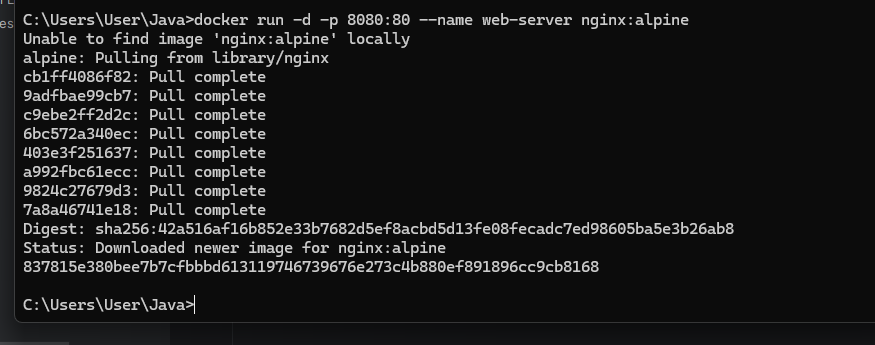
10) http://localhost:8080
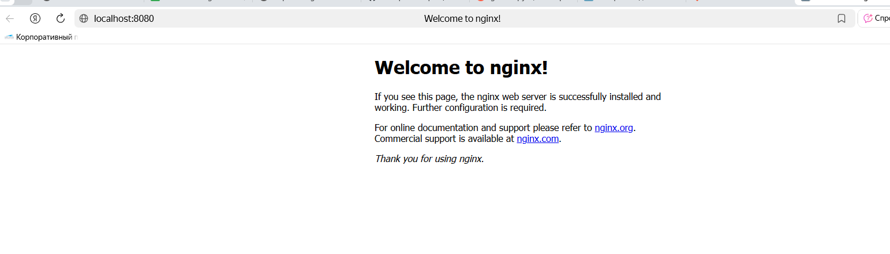
11) docker logs web-server
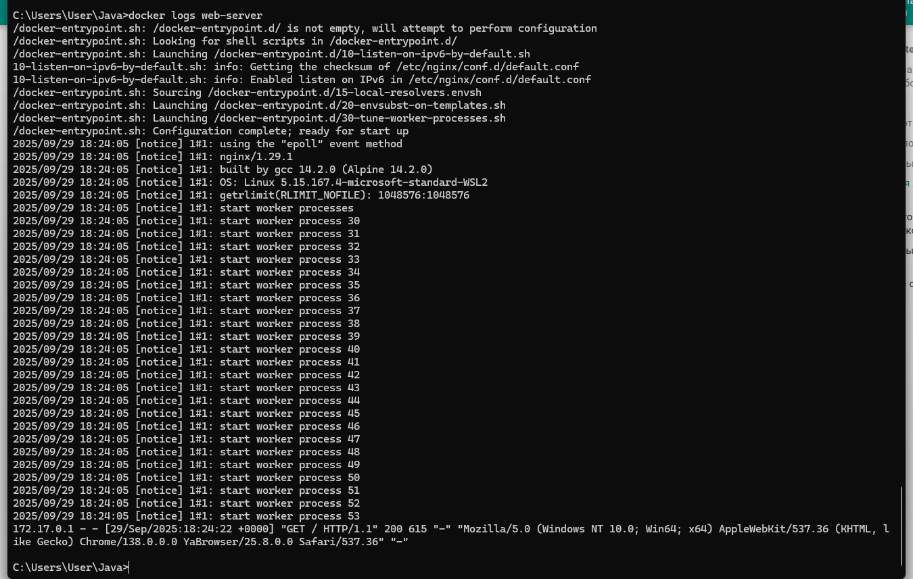
12) docker exec -it web-server sh
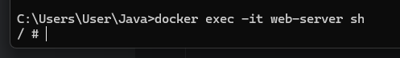
13) docker ps | docker ps -a | docker stop web-server
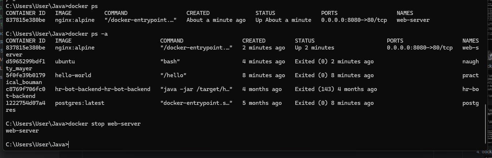
14) docker start web-server
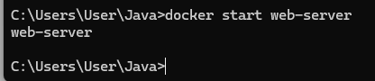
15) docker rm web-server | docker rmi nginx:alpine
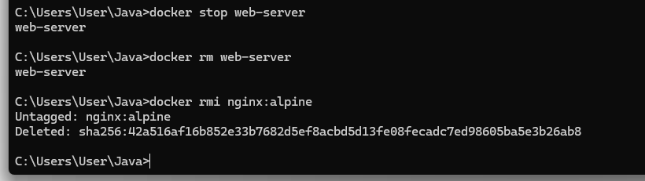
16) docker volume create my-volume
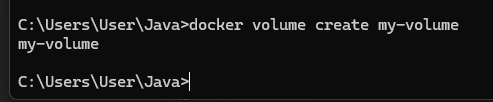
17) docker run -d -v my-volume:/data --name volume-test ubuntu
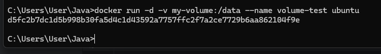
18) docker exec -it volume-test bash
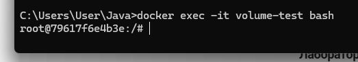
19) Создать файл в томе: echo "Hello from volume" > /data/test.txt
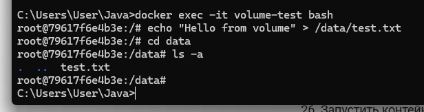