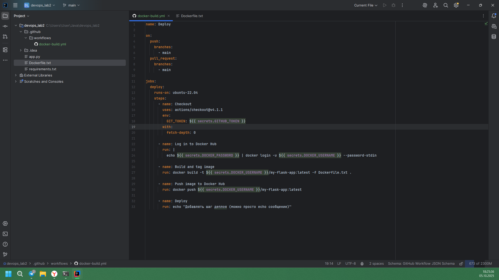
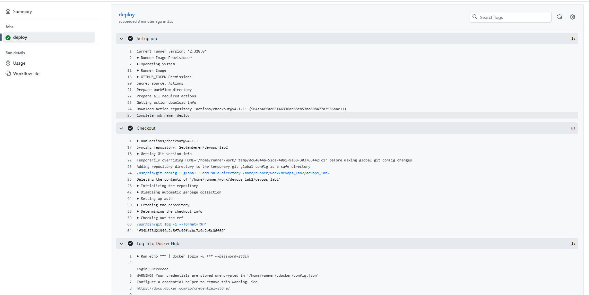

# Отчет по лабораторной №1

University: [ITMO University](https://itmo.ru/ru/)\
Faculty: FTMI\
Course: [introduction-in-web-tech](https://itmo-ict-faculty.github.io/introduction-in-web-tech)\
Year: 2025/2026\
Group: U4225\
Author: Laptev Anatoly Aleksandrovich\
Lab: Lab2\
Date of create: 05.10.2025\
Date of finished: 

1) Подготовка проекта:
* Создал новый репозиторий https://github.com/Septemberer/devops_lab2

* Создать аккаунт на Docker Hub | Создать новый репозиторий на Docker Hub для вашего образа
\

2) Настройка GitHub Actions:
   * Создать папку .github/workflows/ в корне проекта
   * Создать файл docker-build.yml с пайплайном, который должен:
   - [x] Запускаться при пуше в main ветку
   - [x] Использовать Ubuntu как runner
   - [x] Выполнять checkout кода
   - [x] Настраивать Docker Buildx
   - [x] Логиниться в Docker Hub используя секреты
   - [x] Собирать и пушить образ с тегом username/my-flask-app:latest
   - [x] Добавлять шаг деплоя (можно просто echo сообщение)

3) Настройка секретов:
   * DOCKER_USERNAME - ваш логин на Docker Hub
   * DOCKER_PASSWORD - ваш пароль или токен доступа Docker Hub

4) Тестирование пайплайна:
* Сделать коммит и пуш в main ветку

* Проверить выполнение пайплайна в разделе Actions

* Убедиться, что образ появился в Docker Hub

* Проверить логи выполнения каждого шага

