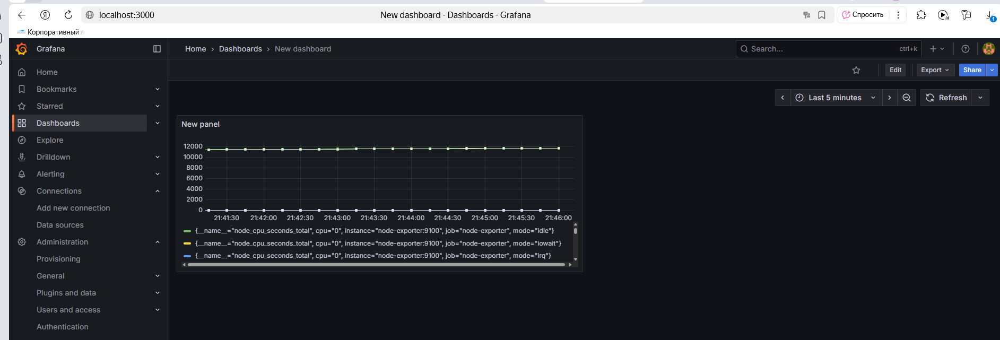
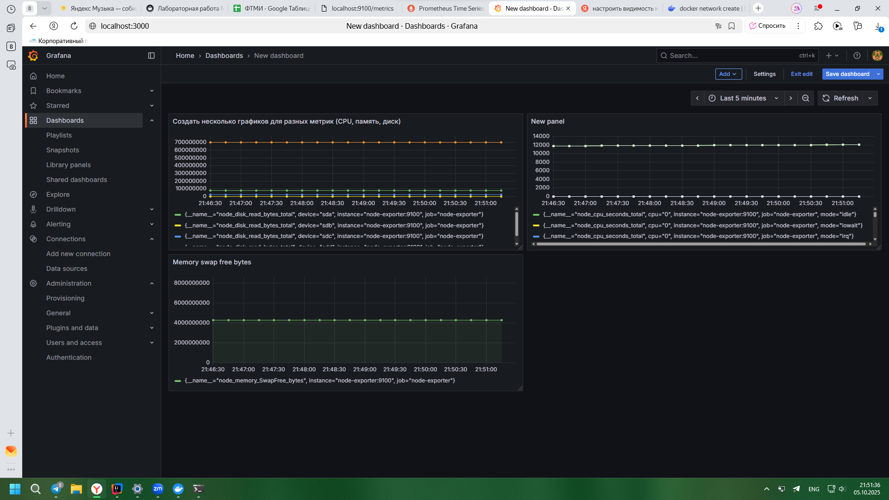

# Отчет по лабораторной №3

University: [ITMO University](https://itmo.ru/ru/)\
Faculty: FTMI\
Course: [introduction-in-web-tech](https://itmo-ict-faculty.github.io/introduction-in-web-tech)\
Year: 2025/2026\
Group: U4225\
Author: Laptev Anatoly Aleksandrovich\
Lab: Lab3\
Date of create: 05.10.2025\
Date of finished: 

1) Создание конфигурации Prometheus:
* Создать папку prometheus для конфигурации
* Создать файл prometheus/prometheus.yml

2) Запуск Node Exporter:
* Запустить контейнер Node Exporter для сбора системных метрик:

* Проверить работу: curl http://localhost:9100/metrics

3) Запуск Prometheus:
* Создать том для данных Prometheus:

* Запустить контейнер Prometheus:

* Проверить работу: открыть http://localhost:9090 в браузере

4) Запуск Grafana:
* Создать том для данных Grafana:

* Запустить контейнер Grafana:

* Проверить работу: открыть http://localhost:3000 в браузере (логин: admin, пароль: admin)

5) Настройка Grafana:
* Войти в Grafana (admin/admin)
* Добавить источник данных Prometheus

* Создать дашборд:

5.1) На самом деле если до этого момента все делать по методичке то ничего не работает, потому что
все эти сервисы находятся в разных контейнерах и не могут связываться друг с другом. 
* Для решения этого понадобилось создать сетевую связанность 

6) Тестирование системы:
* Проверить все контейнеры: docker ps

* Открыть Prometheus и убедиться, что метрики собираются

* Открыть Grafana и проверить отображение графиков

* Создать несколько графиков для разных метрик (CPU, память, диск)
