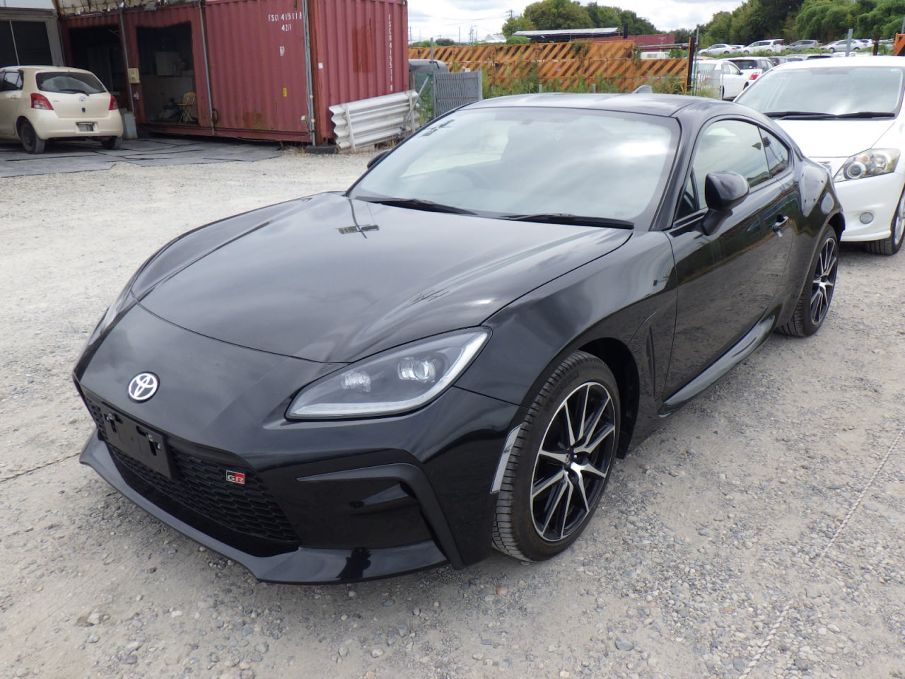

# Описание авто, ТТХ, фото

## TOYOTA GR86

Toyota GR86 — заднеприводное купе, которое в 2021 году переименовали в честь гоночного подразделения Gazoo Racing.
Второе поколение представлено в 2025 году.

### Некоторые ТТХ:

* **Габариты:**
    - длина — 4265 мм,
    - ширина — 1775 мм,
    - высота — 1310 мм,
    - колёсная база — 2575 мм.
* **Вес:** 1270 кг (на 50 кг больше первого поколения).
* **Жёсткость кузова на кручение:** увеличилась на 50%, что повысило стабильность в поворотах.
* **Дизайн:** сохранил узнаваемый профиль с покатой крышей и широкой посадкой, но приобрёл агрессивные черты.
* **Система безопасности:** Subaru EyeSight со стереокамерой, адаптивным круиз-контролем и автоматическим торможением.
* **Дополнительные опции:**
    - обогрев сидений,
    - беспроводная зарядка,
    - поддержка Apple CarPlay/Android Auto.
* **Двигатель:** 2,4-литровый атмосферный боксёр (235 л. с. при 7000 об/мин, 250 Нм при 3700 об/мин).
* **Трансмиссия:** 6-ступенчатая механика.
* **Динамика:** разгон 0–100 км/ч за 6,3 сек., максимальная скорость — 240 км/ч.
* **Подвеска:** McPherson спереди, двойные рычаги сзади.
* **Шины:** 215/45 R17 Michelin Pilot Sport 4.

### Фото Экстерьер

|      |  |
|--------------------------------|--------------------------------|
|  |  |

### Фото Интерьер

|  |  |
|--------------------------------|--------------------------------|
|  |  |

#

-------------------------