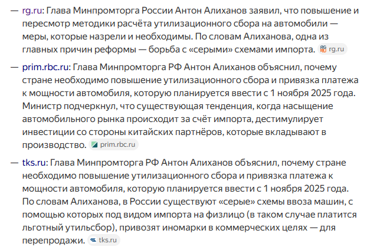

# Негативные аспекты ситуации, почему все плохо

## Глава МинПромТорга очень сильно уверен что введение нового Утильсбора нужно сделать прямо сейчас

## На таможне из-за высокой загрузки могут возникать очереди

## Может случиться задержка в Корее во время перегрузки авто

#

-------------------------