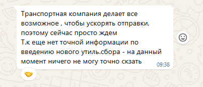
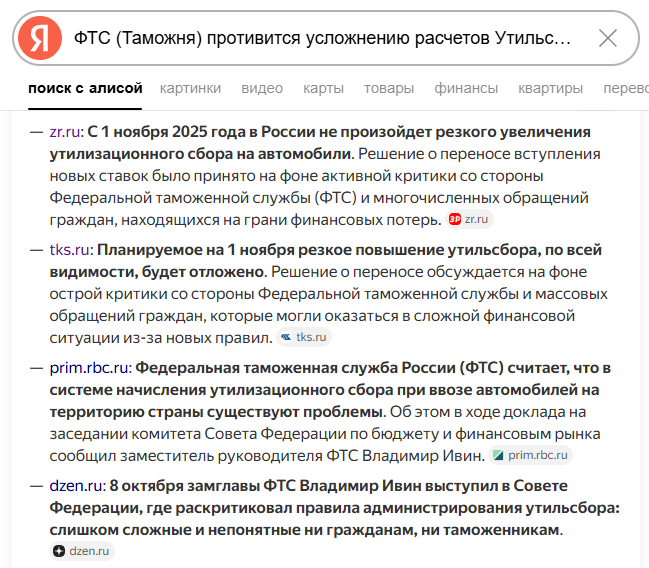
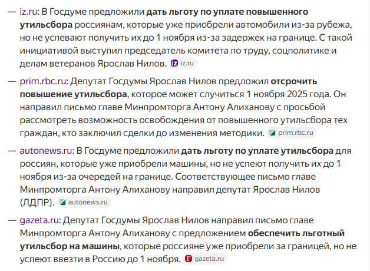
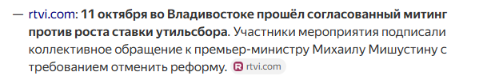

# Позитивные аспекты ситуации, почему все может получиться

## Компания, которая везет авто, уверяет меня что есть все шансы успеть

## Фактическое время пути по воду из Кореи в РФ занимает 2 дня

## Причины по которым введение нового Утильсбора может НЕ состояться 1 ноября

### ФТС (Таможня) противится усложнению расчетов Утильсбора

### В Госдуме предложили дать льготу по уплате Утильсбора для тех кто не успел до 1 ноября

### Общественное неприятие законопроекта

#

-------------------------