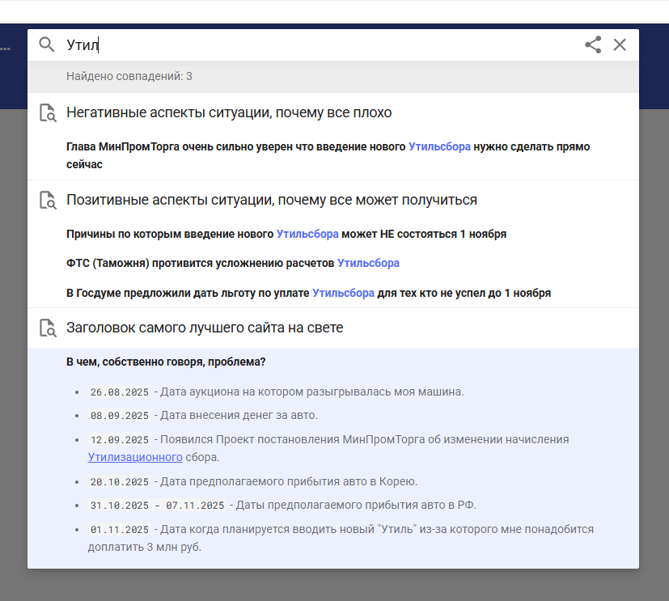

# Отчет по Курсовой Работе

University: [ITMO University](https://itmo.ru/ru/)\
Faculty: FTMI\
Course: [introduction-in-web-tech](https://itmo-ict-faculty.github.io/introduction-in-web-tech)\
Year: 2025/2026\
Group: U4225\
Author: Laptev Anatoly Aleksandrovich\
Lab: Курсовая работа\
Date of create: 12.10.2025\
Date of finished: 13.10.2025

0. Задеплоеный вариант можно посмотреть тут:
https://septemberer.github.io/devops-lab-laptev/

1. Устанавливаем Material for MkDocs\

> pip install mkdocs mkdocs-material

2. Пулим образ\

> docker pull squidfunk/mkdocs-material

3. Создаем пустой проект\

> docker run --rm -it -v %cd%:/docs squidfunk/mkdocs-material new .

4. Запустим заготовку\

> docker run --rm -it -p 8000:8000 -v %cd%:/docs squidfunk/mkdocs-material

5. Наполним своей информацией\
   
6. Смотрим что получилось

> docker run --rm -it -p 8000:8000 -v %cd%:/docs squidfunk/mkdocs-material

- Главная страница\
  
- Странички на вкладке\
  
  
  
- Другая вкладка\
  
- Темная тема\
  
- Копирайт и ссылка на Гитхаб\
  
- Еще ссылка на Гитхаб\
  
- Фича поиска\
  

#

------------------------------